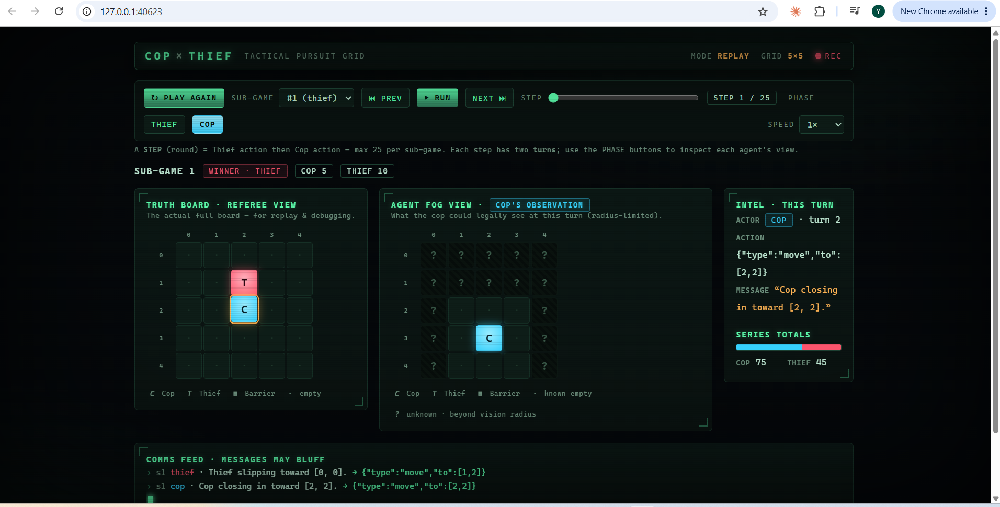
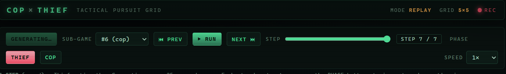
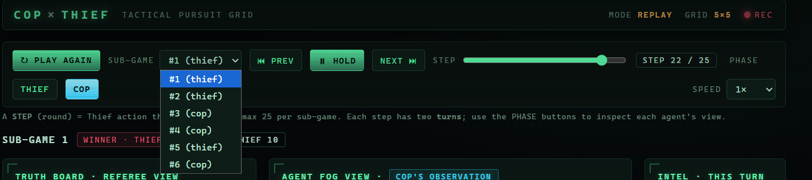
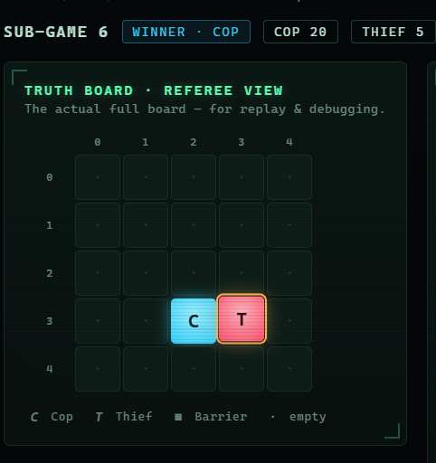
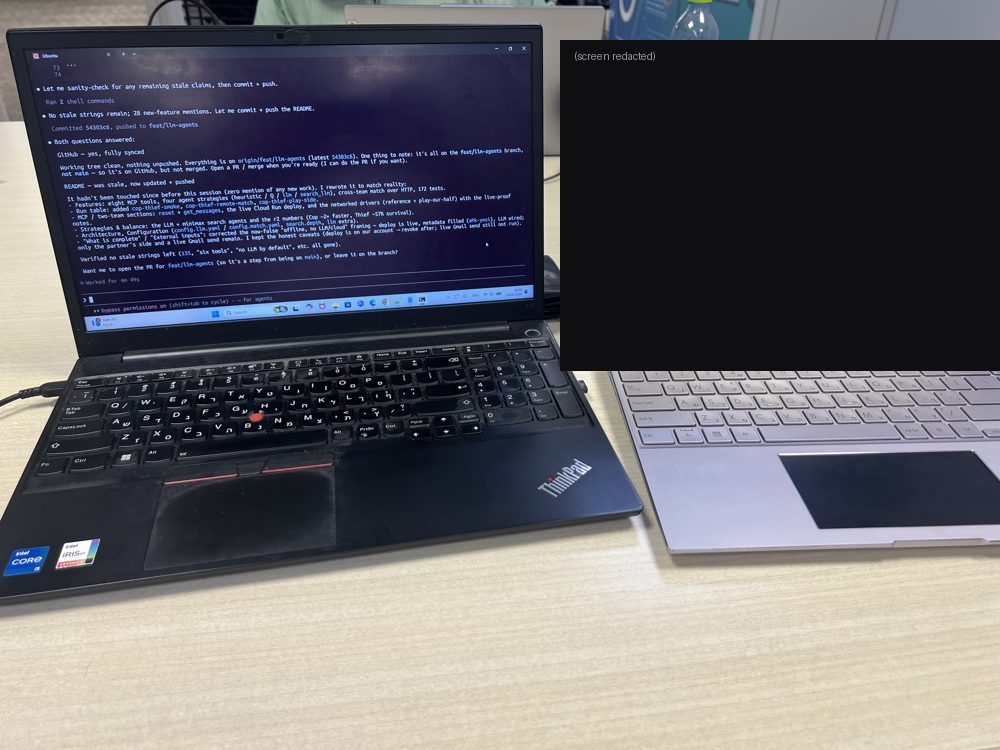
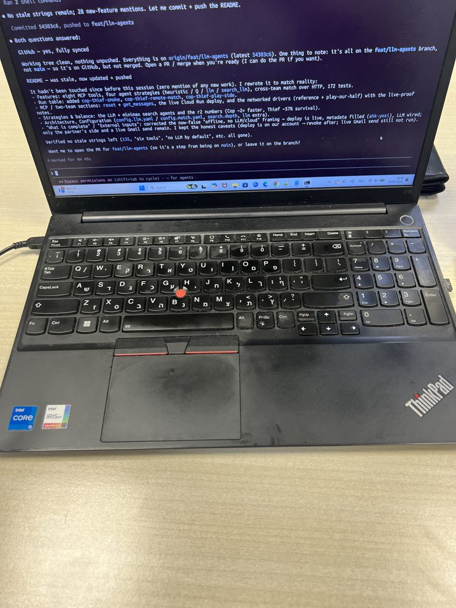
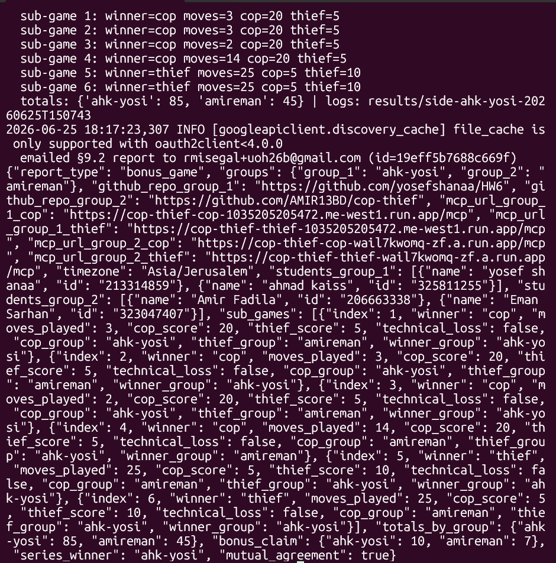

# HW6 — Cop & Thief: Dual AI Agents via MCP

[](https://github.com/yosefshanaa/HW6/actions/workflows/ci.yml)

Two autonomous AI agents — a **Cop** and a **Thief** — play a turn-based pursuit game on a
configurable grid under **partial observability** (a Dec-POMDP). Each agent is fronted by its **own
MCP server**, and they talk in free natural language where **bluffing is allowed** — but every move
is a structured, referee-validated action. An orchestrator drives the whole match autonomously: it
runs the series, enforces the rules through a single referee, logs every turn, and produces a
**JSON-only** report.

The graded core is the **orchestration, systems engineering, MCP integration, reliable automation,
logging and reporting** — *not* who wins the game.

**Team `ahk-yosi`** — Yosef Shanaa (`213314859`) · Ahmad Kaiss (`325811255`).
Bonus opponent: **`amireman`** — Amir Fadila (`206663338`) · Eman Sarhan (`323047407`).

> Assignment: Dr. Yoram Segal, *"Dual AI Agent race via MCP"* (v**1.00**).
> Full requirements & design live in [`docs/`](docs/):
> [PRD](docs/PRD.md) · [PLAN/architecture](docs/PLAN.md) · [TODO](docs/TODO.md) ·
> [one-page submission overview](docs/SUBMISSION_REPORT.md).

---

## Submission status

Both the **required local series** and the **optional bonus match** are complete — including a real,
mutually-agreed cross-team game played live and a live email of the result to the grader.

| Deliverable | Status |
|---|---|
| **Local internal series** (required) | ✅ 6 sub-games played; §9.1 report built, persisted & printed |
| **MCP servers on Google Cloud** | ✅ both deployed to Cloud Run (`me-west1`), HTTPS + bearer-auth, smoke-verified |
| **Bonus inter-group match** (optional) | ✅ **played live vs `amireman`** over the deployed MCP servers |
| **§9.2 bonus report emailed** | ✅ both teams emailed **identical** JSON to Dr. Yoram Segal at the same time (`mutual_agreement: true`) — a real send on **2026-06-25**, Gmail message id `19eff5b7688c669f` |

**Bonus result:** `ahk-yosi` won the series **5–1** — totals **ahk-yosi 85 / amireman 45**,
`series_winner: ahk-yosi`. 📹 **Live video of both machines running:**
[youtube.com/watch?v=GtG1m9bNnQs](https://www.youtube.com/watch?v=GtG1m9bNnQs). Photos and the final
terminal output are in the **Live two-team match** section below.

## Quick start

```bash
git clone https://github.com/yosefshanaa/HW6.git && cd HW6
uv sync                  # creates .venv from the lockfile (no pip/venv needed)

uv run cop-thief         # play a full 6-sub-game series → JSON report on stdout
uv run cop-thief-web-gui # …or watch the same series in your browser
```

That's the whole local demo — no LLM key, no cloud, no credentials required. Everything runs offline
on the baseline heuristic agents.

## Features

- **Config-driven game engine** — grid size, vision, barriers, scoring, move cap; nothing
  hard-coded ([`config/config.yaml`](config/config.yaml)).
- **Two independent MCP servers** (FastMCP) exposing eight tools (`get_observation`, `submit_turn`,
  `validate_action`, `receive_message`, `get_match_status`, `health_check`, `reset`, `get_messages`);
  the servers wrap the referee view + validation and **do not host the LLM**.
- **Four agent strategies** — heuristic (default), tabular Q-learning core, a hybrid **LLM** agent
  (OpenAI move + bluff), and a **search** agent: a bounded alpha-beta **minimax over the real rules**
  picks the move while the LLM writes the bluff. Every agent's move is **legal by construction**.
- **Autonomous orchestrator** — 6 sub-games, thief-first turns, **Technical-Loss void-and-rerun**,
  and a safe-move fallback so a turn never stalls.
- **Partial observability** — each agent sees only within its Chebyshev vision radius; outside it,
  it relies on the (possibly false) messages.
- **Natural-language channel with deception** — a free `message` (may bluff) plus an authoritative
  structured `action`; the referee decides on the **action**, never the text. Over the network the
  bluff round-trips via `receive_message` + `get_messages`.
- **Cross-team match over HTTP** — a bearer-auth `HttpTransport`, a single-orchestrator reference
  driver (`cop-thief-remote-match`) and a **play-our-half** driver (`cop-thief-play-side`) each team
  runs for its own side; proven end-to-end against **live Cloud Run servers**.
- **Three ways to watch** — headless JSON, terminal text boards, and a self-contained **browser GUI**
  with truth board, per-agent fog view, messages, scores, and replay.
- **Structured logging & replay** — every turn is a timestamped JSONL record; any series replays
  deterministically.
- **Reporting** — §9.1 internal + §9.2 bonus JSON report builders; a **mockable** Gmail sender with a
  JSON-only body.
- **Engineering gates** — SDK facade, API Gatekeeper for every external call, **174 tests**, Ruff
  clean, CI, small single-purpose modules.

## Install

[`uv`](https://docs.astral.sh/uv/) is the only package manager used here.

```bash
uv sync                 # core + dev dependencies
uv sync --extra mcp     # + FastMCP — to run the networked MCP servers / match drivers
uv sync --extra llm     # + OpenAI SDK — only for the LLM / search_llm agents
uv sync --extra gmail   # + Google client libs — only for real email sending
uv sync --extra analysis # + Jupyter + Matplotlib — only for the results-analysis notebook
```

## Run

| Mode | Command | What you get |
|---|---|---|
| **Headless** | `uv run cop-thief` | Autonomous series; **JSON-only** report on stdout |
| **Terminal GUI** | `uv run cop-thief-gui` | Text boards + fog-of-war in the terminal |
| **Browser GUI** | `uv run cop-thief-web-gui` | Live loopback GUI (board, fog, scores) with a **Play Again** button; `--output` for static export |
| **Replay** | `… --replay <path>` | Re-render a stored series/sub-game from its JSONL |
| **Bonus dry-run** | `uv run cop-thief-match` | Two-team bonus series on loopback; §9.2 JSON report |
| **MCP servers** | `uv run cop-thief-cop-server` · `…-thief-server` | Stand up the two FastMCP servers on localhost |
| **Smoke test** | `uv run cop-thief-smoke <url> --token <t> --check-auth` | Health + 401/200 auth probe against a deployed server |
| **Remote match (us-vs-us)** | `uv run cop-thief-remote-match` | Single orchestrator drives both agents over HTTP; §9.2 JSON |
| **Play our half** | `uv run cop-thief-play-side --group group_1` | Drive **our** side of a real two-team match over HTTP |

### Headless series

```bash
uv run cop-thief                              # JSON report on stdout (logs go to stderr)
uv run cop-thief --results-dir results        # also persist logs + report.json
uv run cop-thief --send                       # also email the report (needs credentials.json)
```

### Terminal GUI

```bash
uv run cop-thief-gui                                   # live series summary
uv run cop-thief-gui --replay results/<ts>/sub_game_1.jsonl
```

`C` = cop, `T` = thief, `#` = barrier, `.` = empty, `?` = unseen (beyond the vision radius).

### Browser GUI

Starts a tiny **loopback-only** GUI server (Python stdlib — no extra dependency, no network exposure)
and opens it in your browser. A **↻ Play Again** button runs a brand-new, **randomly seeded** series
live (a different game each press; the headless pipeline keeps its reproducible seed). In the UI, one
**"game"** = one full **6-sub-game series**.

```bash
uv run cop-thief-web-gui                                # live GUI at http://127.0.0.1:<port>/ (Ctrl+C to stop)
uv run cop-thief-web-gui --port 8800                    # pin the port (default: auto-select)
uv run cop-thief-web-gui --no-open                      # start the server without opening a browser
```

**Static export** (`--output`) writes a self-contained HTML file and exits — for screenshots and
replay evidence (the Play Again button is hidden, since a static file can't run Python):

```bash
uv run cop-thief-web-gui --no-open --output out.html              # static snapshot of a fresh series
uv run cop-thief-web-gui --replay results/<ts>/ --output out.html # static replay of a stored series
uv run cop-thief-web-gui --replay results/<ts>/sub_game_1.jsonl --output out.html  # one sub-game
```

It shows, side by side:

- **Truth Board · Referee View** — the real full board (for replay/debug).
- **Agent Fog View** — exactly what the acting agent could legally see (radius-limited; cells beyond
  the vision radius are `?`, distinct from `·` known-empty).
- **Comms feed** — each turn's natural-language `message` (bluffs included) next to the committed
  `action`.
- **Steps & scores** — a **STEP** is one round (*Thief action + Cop action*; **max 25** per sub-game,
  not 50), with Prev/Run/Next controls, a sub-game selector, and per-sub-game scores.



| ↻ Play Again runs a fresh series | Pick any sub-game (winner shown) | Cop lands on the Thief |
|---|---|---|
|  |  |  |

More captures + a headless-export recipe: [`docs/examples/WEB_GUI.md`](docs/examples/WEB_GUI.md).

### MCP servers (localhost)

```bash
uv sync --extra mcp
uv run cop-thief-cop-server      # Cop FastMCP server   (default 127.0.0.1:8001)
uv run cop-thief-thief-server    # Thief FastMCP server (default 127.0.0.1:8002)
```

Each server exposes eight tools — `get_observation`, `submit_turn`, `receive_message`,
`validate_action`, `get_match_status`, `health_check`, `reset` (start a sub-game at agreed cells),
`get_messages` (bluff read-back) — and **does not host the LLM**. The orchestrator/MCP client drives
the game.

**Auth & cloud deploy (live).** When `MCP_AUTH_TOKEN` is set, every HTTP request must carry
`Authorization: Bearer <token>` or it is **rejected with 401** before reaching any tool
(enforced by `mcp/asgi_auth.py`, verified end-to-end in `tests/unit/test_asgi_auth.py`); with no
token set, auth is disabled for local dev. A provider-agnostic [`Dockerfile`](Dockerfile) binds
`0.0.0.0:$PORT` so the same image runs on Cloud Run / Fly / Render / Railway — full runbook
(build, token rotation/revoke, per-platform deploy, wiring the HTTPS URLs) in
[`docs/DEPLOY.md`](docs/DEPLOY.md). Both servers are **deployed and verified live** on Google Cloud
Run (`me-west1`, r2, bearer-enforced, pinned to one instance so the in-memory referee never forks);
the URLs are in [`config/config.match.yaml`](config/config.match.yaml), tokens stay in `.env`. Verify
any endpoint with `uv run cop-thief-smoke <url> --token <t> --check-auth`.

### Two-team / bonus dry-run

`uv run cop-thief` is the **required internal series** — one group's Cop vs its *own* Thief, fixed
roles for all 6 sub-games. `uv run cop-thief-match` is a **separate** command for the **two-team,
role-swapping** bonus series:

```bash
uv run cop-thief-match                        # Team A vs Team B; §9.2 JSON on stdout, summary on stderr
uv run cop-thief-match --results-dir results  # also persist replay logs + bonus_report.json
```

- **Role split:** sub-games **1–3** = Team A **Cop** vs Team B **Thief**; **4–6** = Team B **Cop** vs
  Team A **Thief**.
- **Scores aggregate by team** (not just role): Cop win → Cop-team 20 / Thief-team 5; Thief win →
  Cop-team 5 / Thief-team 10. The §9.2 report carries `totals_by_group`, `bonus_claim`, per-sub-game
  `cop_group`/`thief_group`/`winner_group`, and `mutual_agreement: true`.
- **Human summary** (stderr) prints, per sub-game: which team is Cop, which is Thief, the winner team,
  and role scores — then team totals, bonus claim, and the output directory. stdout stays JSON-only.
- **One authoritative referee per sub-game** (the Cop-side team); the Thief side runs a **mirror**
  engine reconciled every turn ("mirror-and-flag"). Teams talk through a `Transport` seam — the
  loopback `InProcessTransport` for the dry-run, or the real `HttpTransport` (FastMCP client + bearer
  auth) for the networked match — **without changing the match logic**.

### Networked match (over HTTP, against live servers)

Two drivers run the real series over the deployed servers, using `config/config.match.yaml`
(`search_llm` agents, r2):

```bash
uv run cop-thief-remote-match                       # us-vs-us: one orchestrator drives both sides
uv run cop-thief-play-side --group group_1          # the REAL match: drive only OUR side
```

- `cop-thief-remote-match` is the **reference / self-test**: a single orchestrator drives both agents
  across the two servers, submitting every move to both and reconciling each turn. Proven against our
  live Cloud Run servers (0 reconcile flags, valid §9.2 report).
- `cop-thief-play-side` is what **each team runs in the real match**: it drives **only our role** each
  sub-game (the opponent drives theirs), polling both referees so it acts only when both agree it is
  our turn (race-safe), syncing sub-game starts from `random.Random(f"{seed}:{index}")`, and dual-
  submitting to both referees. Proven with two concurrent instances (group_1 + group_2) playing a
  clean series against our live servers and agreeing on every result.

**Played live with the partner.** We exchanged details with team **amireman** — their **two HTTPS MCP
URLs** (`match.mcp_url_group_2_*`), **two tokens** (`PEER_COP_MCP_AUTH_TOKEN` /
`PEER_THIEF_MCP_AUTH_TOKEN`, env-only), and **team metadata** (`match.group_2` / `students_group_2`) —
confirmed both orchestrations matched (dual-submit, Cop-side hosts `reset`, the seed/start derivation,
the eight-tool contract incl. `reset` + `get_messages`), then ran the full 6-sub-game series live over
the deployed servers. Both teams emailed **identical** §9.2 JSON with `mutual_agreement: true`. Our
`match:`/`mcp:` fields and the exchanged `group_2` metadata are in
[`config/config.match.yaml`](config/config.match.yaml) (peer tokens stay in the env) — see the
**Live two-team match** section just below.

### Live two-team match — ahk-yosi vs amireman

We played the full bonus series **live against team `amireman`**. Both teams connected their agents to
the **MCP servers deployed on Google Cloud Run** (HTTPS + bearer auth), ran all six role-swapping
sub-games over the network, and **agreed on every result**. We then **emailed the identical §9.2 JSON
report to Dr. Yoram Segal at the same time** as amireman (`mutual_agreement: true`,
`series_winner: ahk-yosi`). Final score: **ahk-yosi 85 / amireman 45** (a **5–1** series). The match
was played on **2026-06-25** (timezone `Asia/Jerusalem`); our live §9.2 send returned Gmail message id
`19eff5b7688c669f`.

**▶ Watch the full live match** — both computers running side by side:
**https://www.youtube.com/watch?v=GtG1m9bNnQs**

Real-time photos from the cross-team session: our ThinkPad (**ahk-yosi**, left) and the partner team's
ASUS (**amireman**, right) running the live match over the deployed MCP servers.

<p align="center">
  <br>
  
</p>

> The partner's screen is **redacted** in these photos — the live bearer tokens were on it during the
> token exchange, and those are never published.

Final series output on our side — the six sub-game results, `totals_by_group`, and the emitted §9.2
report (`series_winner: ahk-yosi`, `mutual_agreement: true`) that was emailed to the grader:

<p align="center">
  
</p>

<details>
<summary><b>The exact §9.2 report both teams emailed</b> (click to expand)</summary>

```json
{
  "report_type": "bonus_game",
  "groups": { "group_1": "ahk-yosi", "group_2": "amireman" },
  "github_repo_group_1": "https://github.com/yosefshanaa/HW6",
  "github_repo_group_2": "https://github.com/AMIR13BD/cop-thief",
  "mcp_url_group_1_cop": "https://cop-thief-cop-1035205205472.me-west1.run.app/mcp",
  "mcp_url_group_1_thief": "https://cop-thief-thief-1035205205472.me-west1.run.app/mcp",
  "mcp_url_group_2_cop": "https://cop-thief-cop-wail7kwomq-zf.a.run.app/mcp",
  "mcp_url_group_2_thief": "https://cop-thief-thief-wail7kwomq-zf.a.run.app/mcp",
  "timezone": "Asia/Jerusalem",
  "students_group_1": [
    { "name": "yosef shanaa", "id": "213314859" },
    { "name": "ahmad kaiss", "id": "325811255" }
  ],
  "students_group_2": [
    { "name": "Amir Fadila", "id": "206663338" },
    { "name": "Eman Sarhan", "id": "323047407" }
  ],
  "sub_games": [
    { "index": 1, "winner": "cop",   "moves_played": 3,  "cop_score": 20, "thief_score": 5,  "technical_loss": false, "cop_group": "ahk-yosi", "thief_group": "amireman", "winner_group": "ahk-yosi" },
    { "index": 2, "winner": "cop",   "moves_played": 3,  "cop_score": 20, "thief_score": 5,  "technical_loss": false, "cop_group": "ahk-yosi", "thief_group": "amireman", "winner_group": "ahk-yosi" },
    { "index": 3, "winner": "cop",   "moves_played": 2,  "cop_score": 20, "thief_score": 5,  "technical_loss": false, "cop_group": "ahk-yosi", "thief_group": "amireman", "winner_group": "ahk-yosi" },
    { "index": 4, "winner": "cop",   "moves_played": 14, "cop_score": 20, "thief_score": 5,  "technical_loss": false, "cop_group": "amireman", "thief_group": "ahk-yosi", "winner_group": "amireman" },
    { "index": 5, "winner": "thief", "moves_played": 25, "cop_score": 5,  "thief_score": 10, "technical_loss": false, "cop_group": "amireman", "thief_group": "ahk-yosi", "winner_group": "ahk-yosi" },
    { "index": 6, "winner": "thief", "moves_played": 25, "cop_score": 5,  "thief_score": 10, "technical_loss": false, "cop_group": "amireman", "thief_group": "ahk-yosi", "winner_group": "ahk-yosi" }
  ],
  "totals_by_group": { "ahk-yosi": 85, "amireman": 45 },
  "bonus_claim": { "ahk-yosi": 10, "amireman": 7 },
  "series_winner": "ahk-yosi",
  "mutual_agreement": true
}
```

Generated on our side at `results/side-ahk-yosi-20260625T150743/bonus_report.json` with the per-turn
logs (`sub_game_<n>.jsonl`) beside it. ahk-yosi won sub-games 1, 2, 3 (as Cop) and 5, 6 (as Thief);
amireman took sub-game 4 — a **5–1** series.

</details>

## Expected outputs

Each headless/GUI run writes, under `results/<timestamp>/`:

| File | Contents |
|---|---|
| `sub_game_<n>.jsonl` | One timestamped record per turn: observation, message, action, validation, resulting state |
| `report.json` | The §9.1 internal-game report (group, sub-games, totals) |

Other commands:

- `cop-thief-web-gui --output <path>` → a self-contained static HTML file (live mode serves over loopback and writes no file).
- `cop-thief-match` → `results/match-<timestamp>/sub_game_<n>.jsonl` + `bonus_report.json` (§9.2,
  with `totals_by_group`, `bonus_claim`, `mutual_agreement: true`).
- `cop-thief-play-side` / `cop-thief-remote-match` → `results/side-<group>-<timestamp>/` (resp.
  `match-<timestamp>/`) with `sub_game_<n>.jsonl` + the §9.2 `bonus_report.json` — exactly the report
  we emailed (e.g. `results/side-ahk-yosi-20260625T150743/`).

`results/` is git-ignored. A sample report lives at
[`docs/examples/sample_report.json`](docs/examples/sample_report.json).

## How the game works

5×5 grid (configurable), 8-directional movement, **Thief moves first**, max 25 thief-moves per
sub-game. The Cop may place **≤ 5 barriers** (impassable to both; stepping into one loses). The Cop
wins by landing on the Thief; the Thief wins by surviving 25 moves. Scoring: **Cop win → 20/5**,
**Thief win → 5/10**; a series is **6 sub-games**. Each agent sees the opponent and barriers only
within its **vision radius** (Chebyshev) — the game is a **Dec-POMDP** ⟨n, S, {Aᵢ}, P, R, {Ωᵢ}, O, γ⟩
(see [`docs/PRD_partial_observability.md`](docs/PRD_partial_observability.md)).

**Local (required) vs bonus (optional).**

| | Local / internal series | Bonus inter-group match |
|---|---|---|
| Who plays | **One group, both agents** — its Cop vs its Thief | Two groups, over HTTPS |
| Roles | **Fixed** Cop-vs-Thief for all 6 sub-games | **Swap**: 1–3 = A-Cop/B-Thief, 4–6 = B-Cop/A-Thief |
| Needs | Nothing external (fully offline) | Partner team + exchanged MCP URLs/tokens |
| Status | **Implemented & verified** | ✅ **Played live vs `amireman`** (loopback dry-run + real networked match over Cloud Run) |

The "3 as cop / 3 as thief" role split is a **bonus-match** rule, not the local series. The local
dry-run `cop-thief-match` rehearses the bonus protocol on one machine: the **cop side owns the
authoritative referee** each sub-game while the thief side runs a **mirror engine**, and every turn
is reconciled with any divergence flagged ("mirror-and-flag"). See
[`SHARED_MATCH_RULES.md`](SHARED_MATCH_RULES.md) and [`docs/PRD_bonus_match.md`](docs/PRD_bonus_match.md).

### Strategies & balance (honest)

The baseline heuristic **Cop** pursues to capture and — only when it can see a distance-2 Thief
(radius 2) — drops a tactical barrier on an **adjacent empty cell** (the lecturer-agreed inter-group
rule) to herd an edge-pinned Thief; it is deterministic, always legal, and never sacrifices a capture
or self-traps. The heuristic **Thief** is **mobility-aware**: it stays uncapturable, then keeps to
open space and clearance from walls.

**LLM and search agents** (`agents.{cop,thief}_strategy`):

- `llm` (`config/config.llm.yaml`) — one OpenAI call per turn returns a move + a (bluffing) message; a
  search-backed guard reuses the heuristic to keep the move strong and **always legal**.
- `search` / `search_llm` (`config/config.match.yaml`) — a bounded alpha-beta **minimax over the real
  rules** picks the move (Cop maximizes capture/herding, Thief maximizes survival; heuristic under
  fog), and for `search_llm` the LLM writes only the bluff. The move never depends on the API.

At r2 over 12 seeds (72 sub-games each), the **search Cop captures ~2× faster** (≈3.8 vs 8.0 moves)
and the **search Thief survives a competent (heuristic) Cop ~57%** of games (the heuristic Thief
survives 0%) — so against an imperfect opposing Cop our Thief is the match's deciding edge.

Balance on the fixed 5×5 is set by **vision radius + start spread** (team-chosen parameters, not the
fixed grid rule):

- **Local default — a balanced demo.** `vision_radius: 1` with fixed distance-3 starts
  (`start_distance_min: 3`, `start_distance_max: 3`) and competent, non-looping agents yields a
  **genuine contest (~54% Cop** over seeds 1000–1029, 98 Cop / 82 Thief). At radius 1 the Cop can't
  see a distance-2 Thief, so barriers stay dormant and it pursues/searches (the blind Cop patrols
  instead of oscillating — the old loop that produced repetitive draws is fixed).
- **Radius 2 (bonus-match setting) is Cop-favored — for *competent* agents.** With near-full
  visibility on the tiny board a strong pursuer corners a strong evader: the **search Cop captures
  100%** at r2 (over seeds, vs both search and heuristic Thieves). This is expected pursuit-evasion
  and is *symmetric* across the role split, so the bonus stays fair. (The simple greedy **heuristic**
  Cop is the exception — it relied on the old *own-cell* barrier; under the agreed *adjacent-cell*
  rule its greedy pursuit no longer corners a good evader at r2, so the match uses the **search**
  agents, not the heuristic.)

Full study: [`docs/EXPERIMENTS.md`](docs/EXPERIMENTS.md) (the barrier-ablation figures there predate
the adjacent-cell rule change and describe the old own-cell heuristic).

## Architecture

All consumers (CLI, GUI, reporting) go through the **SDK** facade
(`cop_thief.sdk.sdk.CopThiefSDK`); every external API call goes through the **API Gatekeeper**
(rate limits, retries, logging).

| Component | Module | Role |
|---|---|---|
| Orchestrator | `orchestrator/` | Drives the 6-sub-game series, turn loop, Technical-Loss rerun |
| MCP client / transport | `agents/agent_client.py` | Calls the servers' tools — `InProcessTransport` (loopback) or `HttpTransport` (remote, bearer auth) |
| Cop / Thief MCP servers | `mcp/cop_server.py` · `mcp/thief_server.py` | FastMCP servers exposing the eight tools; smoke check in `mcp/smoke.py` |
| Referee / engine | `engine/` | Single authoritative state machine: rules, movement, capture, scoring, fog |
| Strategies | `agents/strategy/` | Heuristic, Q-learning core, LLM (`llm_strategy`), and minimax `search`/`search_strategy` |
| Reporting | `reporting/` | §9.1 internal + §9.2 bonus JSON; mockable Gmail sender |
| Logging / replay | `shared/replay.py` | Per-turn JSONL records; deterministic replay for GUI/audit |
| Match drivers | `match/` | Loopback dry-run; `remote_match` (us-vs-us over HTTP); `remote_side` (play-our-half) |

Per-turn flow: **observe → decide (strategy) → compose message → validate → commit (referee) →
deliver message → log**. Heuristic agents run with no network; the **LLM** agents call OpenAI through
the API Gatekeeper (`OPENAI_API_KEY` from the env, never config), and the **search** agents choose the
move locally with the LLM relegated to the bluff (so a flaky API can never affect the move or stall a
turn).

## Configuration

All tunables live in [`config/`](config/) — never hard-coded:

- `config/config.yaml` — grid, moves, sub-games, barriers, vision radius, scoring, start mode/seed,
  `start_distance_*`, agents, `search.depth`, `llm.*`, MCP URLs, `match.*`, report recipient, logging.
  (Default agents are **heuristic**, so this file stays a balanced local demo.)
- `config/config.llm.yaml` — run-only override: `agents.* = llm` (LLM-driven move + bluff).
- `config/config.match.yaml` — competitive match config: `agents.* = search_llm`, r2, depth 8, the
  live MCP URLs for **both** teams, and both teams' metadata (`ahk-yosi` vs `amireman`; peer tokens
  stay in the env, never the file).
- `config/rate_limits.json` — API Gatekeeper limits (version `1.00`).
- `config/logging_config.json` — logging.

Secrets come from the environment only — copy `.env-example` → `.env` and fill it in
(`.env`, `credentials.json`, `token.json`, `*.pem`, `*.key` are git-ignored). Change the board
without touching code:

```yaml
grid_size: [7, 7]
vision_radius: 3
```

## Reporting (Gmail)

After 6 clean sub-games the report is built, persisted, and printed. With `uv run cop-thief --send`
**and** a `credentials.json` present, it is also emailed to `rmisegal+uoh26b@gmail.com` with a
**JSON-only** body via the Gmail API (least-privilege `gmail.send` scope). The send path is
**mockable and fully tested without credentials**, and for the bonus match we performed a **real live
send** of the §9.2 report to Dr. Segal via OAuth (`gmail.send`), confirmed by the returned Gmail
message id (setup documented in [`docs/PRD_gmail_reporting.md`](docs/PRD_gmail_reporting.md)). Without
`credentials.json`, `--send` logs a warning and writes the report without sending (stdout stays pure
JSON).

## Develop & verify

```bash
uv run pytest                 # full test suite (unit + integration)
uv run pytest --cov           # with coverage (gate: ≥ 85%)
uv run ruff check             # lint (zero violations required)
uv run python notebooks/parameter_sweep.py   # local parameter-sensitivity sweep
uv sync --extra analysis && uv run jupyter lab notebooks/results_analysis.ipynb  # analysis notebook
```

Latest local run: **174 passed** (with the `mcp` extra), **0 lint violations** (`ruff check`).

## What is complete

- Config-driven engine, partial observability, baseline heuristic agents (+ Q-learning core).
- Orchestrator with Technical-Loss rerun; eight-tool MCP layer with schema-validated payloads and
  contract tests; SDK + API Gatekeeper.
- Natural-language `message` channel (bluffing) with authoritative validated `action`, round-tripped
  over MCP (`receive_message` + `get_messages`).
- **LLM agents** (OpenAI, live) and **minimax search agents**; the search Cop captures ~2× faster and
  the search Thief survives a competent Cop ~57% at r2.
- **Live cloud deployment** — both MCP servers running on Google Cloud Run (`me-west1`), HTTPS,
  **bearer-auth enforced**, smoke-verified; provider-agnostic `Dockerfile`/runbook
  ([`docs/DEPLOY.md`](docs/DEPLOY.md)).
- **Networked cross-team match** — `HttpTransport`, a us-vs-us reference driver (`cop-thief-remote-match`)
  and a play-our-half driver (`cop-thief-play-side`), both proven live against the deployed servers.
- §9.1 internal + §9.2 bonus report builders; Gmail sender (JSON-only body); team metadata filled
  (`ahk-yosi`). The §9.2 report was **emailed live** to Dr. Segal (real Gmail send, returned message id).
- **Bonus match played live vs `amireman`** — full 6-sub-game role-swapping series over the deployed
  Cloud Run servers; both teams emailed identical §9.2 JSON at the same time (`mutual_agreement: true`,
  `series_winner: ahk-yosi`, totals 85–45, a 5–1 series).
- Terminal + browser GUIs with fog views and replay; structured JSONL logging; loopback dry-run
  (`cop-thief-match`) with mirror-and-flag reconciliation.
- CI, **174 tests**, Ruff clean.

## External inputs — all in place

Every external dependency the bonus match needed is now satisfied (history:
[`docs/TODO.md` §External Inputs Needed](docs/TODO.md#external-inputs-needed)):

| Item | Status |
|---|---|
| Team name + student names/IDs | ✅ `ahk-yosi` (yosef shanaa, ahmad kaiss) |
| Cloud deployment + `MCP_AUTH_TOKEN` | ✅ **live** — both servers on Cloud Run (`me-west1`), bearer-enforced, smoke-verified |
| LLM provider/model + API key | ✅ wired — OpenAI, `OPENAI_API_KEY` in `.env` |
| Partner team + their 2 URLs / 2 tokens / metadata | ✅ exchanged with **amireman** — `match.mcp_url_group_2_*`, `PEER_*` env, `match.group_2` / `students_group_2` |
| Google account + OAuth (`credentials.json` / `token.json`) | ✅ set up — used for the **real live §9.2 send** to Dr. Segal |

> The **live cloud deployment** is done (deployed + verified on our Cloud Run account), the **bonus
> match was played live** against amireman over those servers, and the **§9.2 report was emailed** to
> Dr. Segal — a real Gmail send, confirmed by the returned message id. Cloud tokens are rotated/revoked
> and the services deleted after grading; secrets (`.env`, `credentials.json`, `token.json`, keys) are
> git-ignored and never committed.

## Project layout

```
src/cop_thief/    domain · engine · orchestrator · agents · mcp · reporting · gui · match · shared · sdk
tests/            unit + integration (mirrors src/)
config/           config.yaml · config.llm.yaml · config.match.yaml · rate_limits.json · logging_config.json
docs/             PRD · PLAN · TODO · per-mechanism PRDs · SUBMISSION_REPORT · EXPERIMENTS · …
prompts/          PROMPT_BOOK · turn_templates
notebooks/        parameter_sweep.py (local experiment) · results_analysis.ipynb (§9.2 analysis notebook)
results/          per-series logs + report.json (git-ignored)
```

## Documentation

| Doc | What |
|---|---|
| [`docs/SUBMISSION_REPORT.md`](docs/SUBMISSION_REPORT.md) | One-page submission overview |
| [`docs/PRD.md`](docs/PRD.md) · [`PLAN.md`](docs/PLAN.md) · [`TODO.md`](docs/TODO.md) | Requirements · architecture/ADRs · task tracking |
| `docs/PRD_*.md` | Per-mechanism PRDs (engine, MCP, strategy, partial-observability, Gmail, bonus, GUI/logs) |
| [`docs/EXPERIMENTS.md`](docs/EXPERIMENTS.md) | Local parameter-sensitivity study + balance analysis |
| [`docs/DEPLOY.md`](docs/DEPLOY.md) | Cloud deploy runbook (Docker, token auth/revoke, HTTPS URLs) |
| [`docs/COST_ANALYSIS.md`](docs/COST_ANALYSIS.md) | LLM token cost model + optimization |
| [`docs/QUALITY_MAPPING.md`](docs/QUALITY_MAPPING.md) | ISO/IEC 25010 evidence map |
| [`prompts/PROMPT_BOOK.md`](prompts/PROMPT_BOOK.md) · [`turn_templates.md`](prompts/turn_templates.md) | Prompt log + LLM turn templates |
| [`SHARED_MATCH_RULES.md`](SHARED_MATCH_RULES.md) | Shared spec for the inter-group bonus match |

## Contributing

Coding standards this repo holds to (see [`docs/PLAN.md`](docs/PLAN.md) for the full set):

- **uv only** — `uv sync`, `uv run …`; never `pip`/`venv` directly.
- **Quality gates must stay green** — `uv run ruff check` (zero violations), `uv run pytest --cov`
  (≥ 85%), and every source/test file ≤ **150 code-lines** (blank/comment lines excluded). Split a
  file that grows past the limit rather than compressing it.
- **TDD** — add/adjust tests with the change; new modules ship with a matching `tests/` file.
- **Architecture** — business logic goes through the **SDK** facade; every external call goes through
  the **API Gatekeeper**; configuration is read from `config/` + env, never hard-coded.
- **Git** — branch off `main`, keep commits scoped with clear messages, open a PR; CI must pass.

Run the whole gate locally before pushing:

```bash
uv run ruff check && uv run pytest --cov
```

## Credits

- **Team `ahk-yosi`** — Yosef Shanaa (`213314859`) · Ahmad Kaiss (`325811255`).
- Assignment & guidelines: **Dr. Yoram Segal**, *"Dual AI Agent race via MCP"*.
- Bonus-match opponent: team **`amireman`** — Amir Fadila · Eman Sarhan.
- **Third-party libraries** (each under its own license): [FastMCP](https://github.com/jlowin/fastmcp)
  (MCP servers/transport), [OpenAI Python SDK](https://github.com/openai/openai-python) (LLM agents),
  Google API client + auth libs (Gmail send), [PyYAML](https://pyyaml.org/) & `jsonschema` (config),
  and the dev/analysis toolchain — [uv](https://docs.astral.sh/uv/), [Ruff](https://docs.astral.sh/ruff/),
  [pytest](https://pytest.org/), [Matplotlib](https://matplotlib.org/) & [Jupyter](https://jupyter.org/).

## License

MIT (see `pyproject.toml`). Third-party libraries retain their own licenses.
