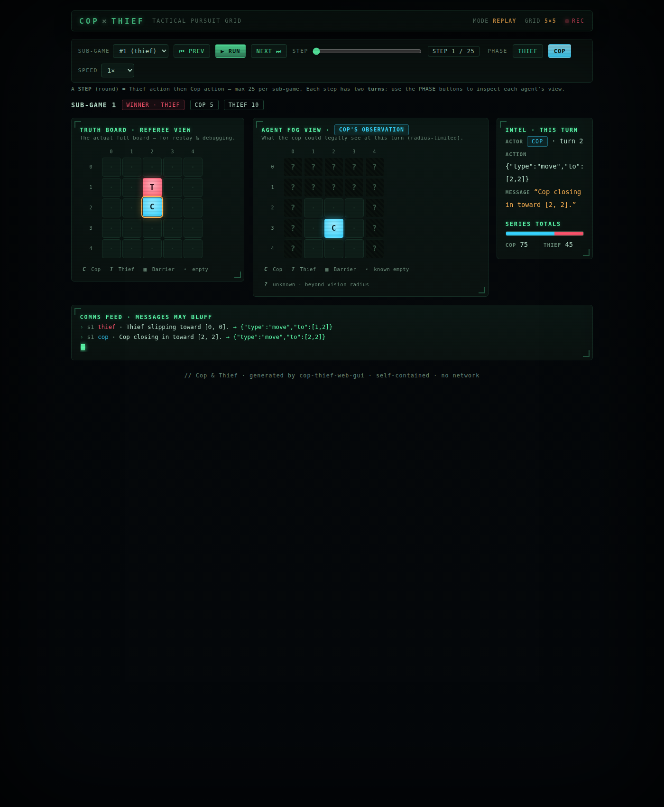
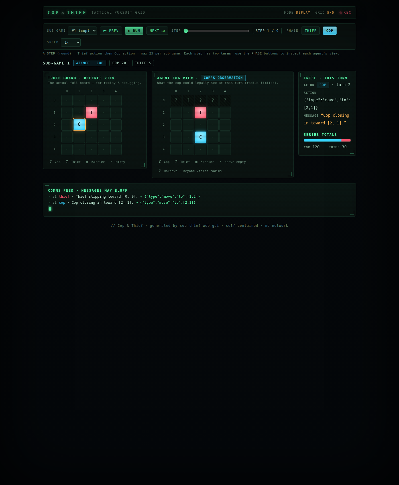
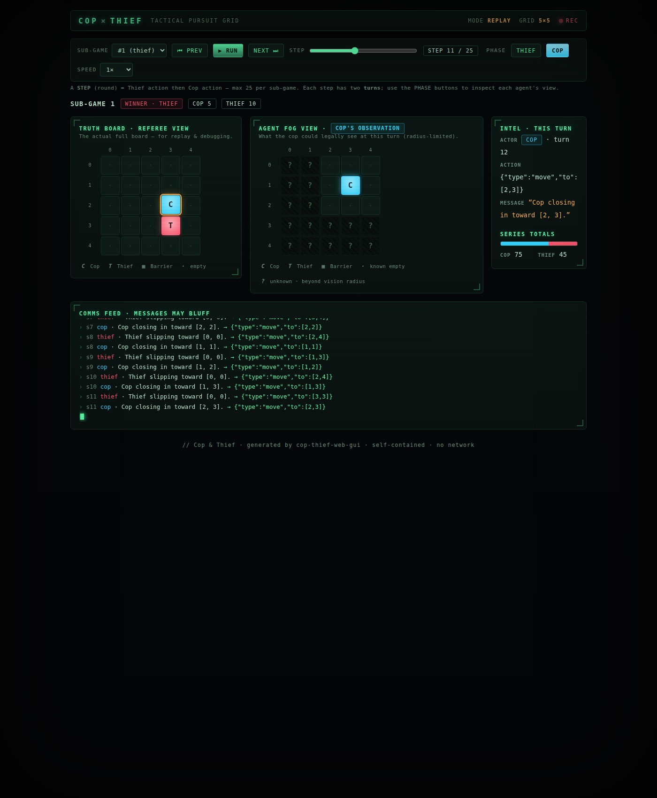
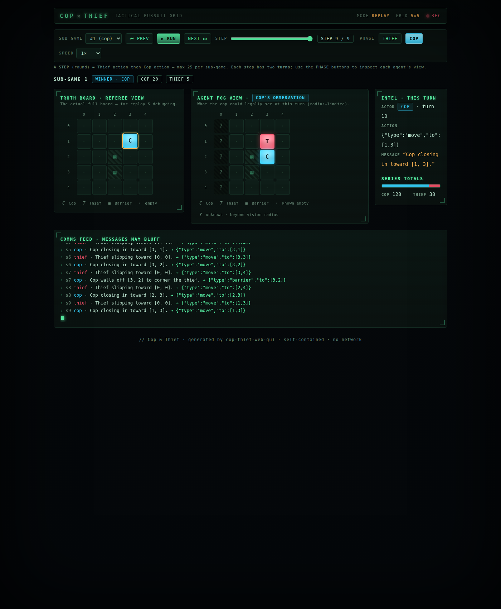

# Browser GUI evidence

The browser GUI (`uv run cop-thief-web-gui`) renders a **self-contained, local** HTML page — no
network, no CDN, no external services. Data is embedded directly in the page as JSON. The styling is
a **noir tactical surveillance terminal**: phosphor-green CRT with scanlines, cyan = Cop sweep,
amber-red = Thief, HUD corner-brackets, coordinate rulers, and a live "comms feed". All offline
(monospace system fonts, pure CSS/JS).

## Curated sample

[`sample_web_gui.html`](sample_web_gui.html) — a real replay of a full 6-sub-game series (shows the
Cop placing **tactical barriers**). Open it in any browser (double-click, or `file://` path).
Regenerate with:

```bash
uv run cop-thief --results-dir results
uv run cop-thief-web-gui --replay results/<ts>/ \
    --no-open --output docs/examples/sample_web_gui.html
```

## What the page shows

```
 COP × THIEF                                  MODE REPLAY  GRID 5×5  ●REC
 [Sub-game ▼] ⏮Prev ▶Run Next⏭  STEP [===|---]  STEP 4/13  PHASE [Thief][Cop]
 A STEP (round) = Thief action then Cop action — max 25 per sub-game.

 ┌─ Truth Board · Referee View ─┐  ┌─ Agent Fog View · Cop's observation ─┐  ┌─ Intel ─┐
 │   0 1 2 3 4                   │  │   0 1 2 3 4                            │  actor Cop
 │ 0 · · · · ·                   │  │ 0 C · · ? ?                            │  turn 7
 │ 1 · · · · ·                   │  │ 1 · · · ? ?                            │  action move
 │ 2 · · C · ·                   │  │ 2 ? ? ? ? ?                            │  msg "closing"
 │ 3 · · · T ·                   │  │ 3 ? ? ? ? ?                            │
 │ 4 · · ▦ · ·                   │  │ 4 ? ? ? ? ?                            │  totals
 └──────────────────────────────┘  └───────────────────────────────────────┘  cop / thief
   C=Cop T=Thief ▦=Barrier ·=empty    …plus ?=unknown (beyond vision radius)
```

- **Truth Board · Referee View** — the actual full board (replay/debug): `C`=cop, `T`=thief,
  `▦`=barrier, `·`=empty.
- **Agent Fog View · <agent>'s observation** — only what the acting agent could legally see;
  `?` (hatched) = **unknown / beyond the vision radius**, clearly distinct from `·` known-empty.
- **STEP** = one round = Thief action + Cop action (**max 25**, not 50). The **PHASE** buttons
  (Thief / Cop) switch which agent's turn/observation is shown within the step.
- **⏮ Prev / ▶ Run / Next ⏭** step by round; **speed** 0.5×/1×/2×.
- **Winner / per-sub-game scores**, **series totals**, and a **comms feed** (messages may bluff).

## Screenshots

Real headless-Chrome captures of the live page, committed under [`../../assets/`](../../assets/):

| Local default — 5×5, radius 1 (balanced) | Bonus setting — radius 2 (Cop-favored) |
|---|---|
|  |  |
|  |  |

Top row = start positions; bottom row = several steps in (a real multi-turn pursuit, the comms feed
filling, scores updating). Each shows the **Truth Board**, the acting agent's **fog view** (`?` =
beyond vision), the **comms feed** (messages may bluff), and **scores/totals**.

Regenerate and re-capture (no browser UI needed):

```bash
uv run cop-thief-web-gui --no-open --output results/web_gui.html
google-chrome --headless=new --no-sandbox --hide-scrollbars \
    --virtual-time-budget=2500 --window-size=1400,1700 \
    --screenshot=assets/screenshot_gui_live.png "file://$PWD/results/web_gui.html"
```
